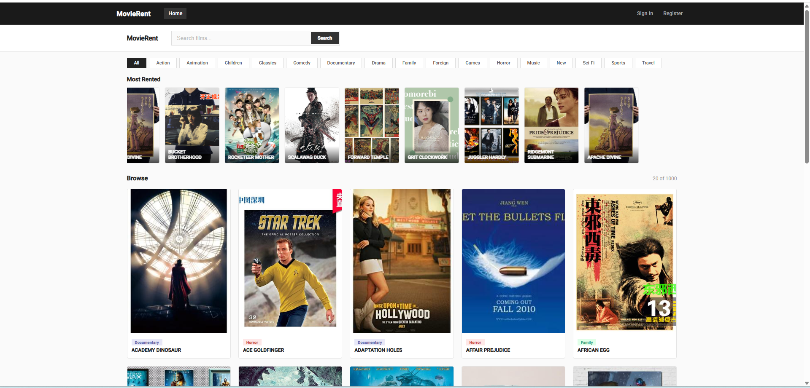
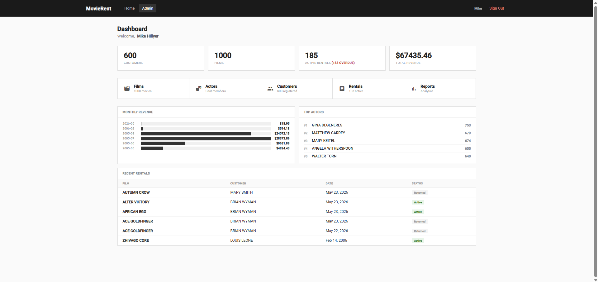
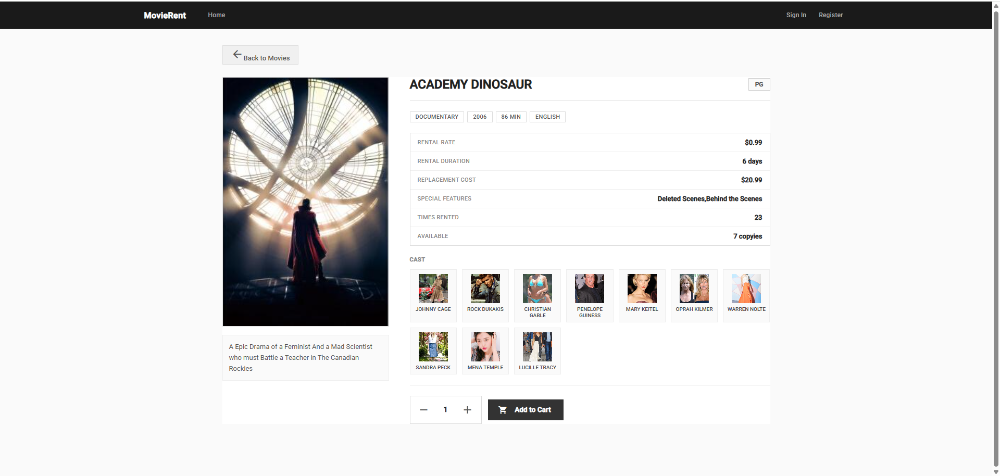
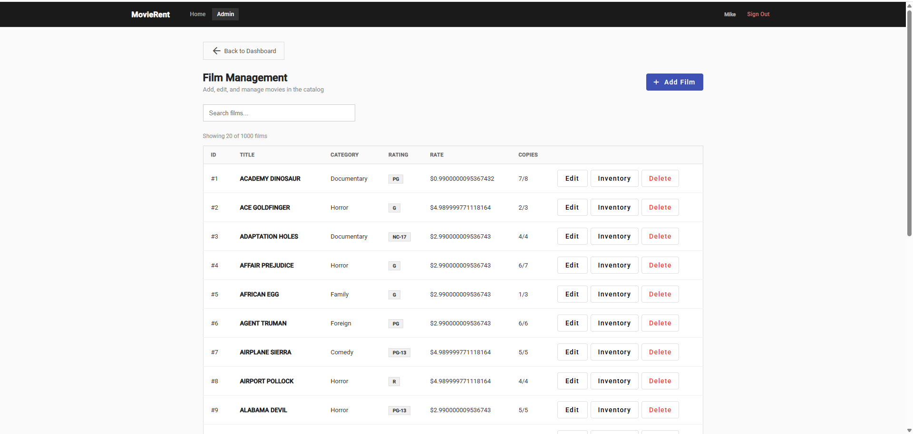
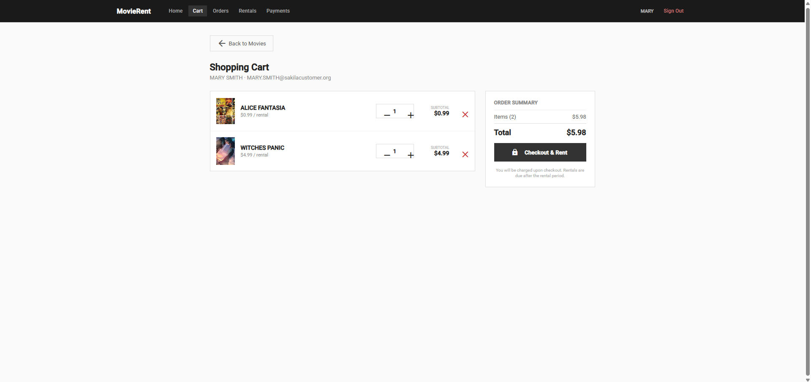
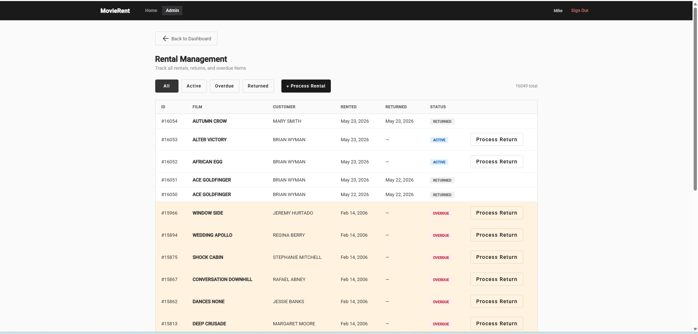
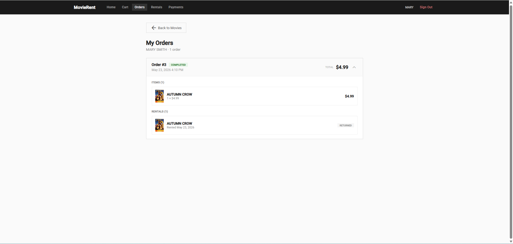
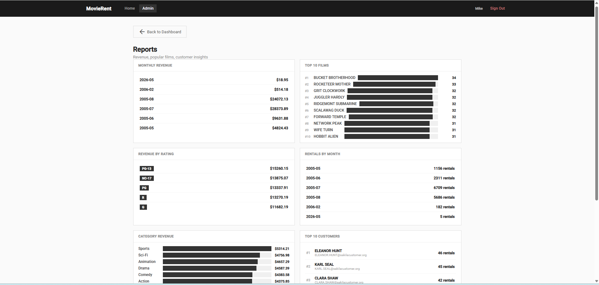

# MovieRent — Full-Stack Movie Rental Platform

A professional full-stack movie rental application built with **Spring Boot 3 + Angular 16**. Features customer-facing browsing, shopping cart, rentals, orders, and a complete admin panel with analytics and management tools.

---

## Screenshots

> <!-- Replace the src paths below with your own screenshots -->
> 
> Create a folder `screenshots/` in the repo root and add your images there.

| Customer Portal | Admin Dashboard |
|----------------|-----------------|
|  |  |
|  |  |
|  |  |
|  |  |

---

## Features

### Customer Portal
- **Browse films** — search by title, filter by category, paginated grid with film posters
- **Film details** — view cast, specs, available copies, rental stats, popularity
- **Actor profiles** — filmography with rental performance
- **Shopping cart** — add/remove items, adjust quantities, checkout
- **Orders & Rentals** — order history with expandable details, return films
- **Payment history** — transaction records with totals
- **Customer profile** — personalized stats and quick navigation

### Admin Dashboard
- **Analytics overview** — monthly revenue chart, top actors, zero-inventory alerts, recent rentals
- **Films management** — full CRUD with inventory tracking (add/remove copies)
- **Actors management** — CRUD with filmography and rental statistics
- **Customers management** — view details, edit info, toggle active status, rental history
- **Rentals management** — filterable list (active/returned/overdue), process returns and walk-in rentals
- **Reports** — monthly revenue, top 10 films, revenue by rating, rentals by month, category performance, top customers

### Security
- Route guards for admin and customer sections
- Staff-only admin panel with separate authentication

---

## Tech Stack

| Layer | Technology |
|-------|-----------|
| **Backend** | Java 17, Spring Boot 3.2, Spring Data JPA, Hibernate, MySQL, Lombok, Maven |
| **Frontend** | Angular 16.2, TypeScript, Angular Material 16, RxJS, SCSS |
| **Database** | MySQL 8 (Sakila sample database + custom extension tables) |
| **Tooling** | Lombok annotation processor, Maven wrapper |

---

## Database

Built on the **Sakila** sample database with 4 custom tables:

- `cart` / `cart_item` — per-customer shopping cart
- `rental_order` / `order_item` — checkout orders with line items
- `rental.order_id` — links rentals back to orders

**Key data:** 1,000 films · 16 categories · 200 actors · 600 customers · 2 stores · 16,048 rentals · 16,053 payments

### Migration

```sql
-- Run migration-new-tables.sql against your sakila database once
mysql -u root -p sakila < movie_rental_backend/src/main/resources/migration-new-tables.sql
```

---

## Quick Start

### Prerequisites
- Java 17+
- Node.js 18+
- MySQL 8 with Sakila database

### Backend

```bash
cd movie_rental_backend
# Edit src/main/resources/application.yml with your MySQL credentials
./mvnw spring-boot:run
```

Runs on `http://localhost:8080`

### Frontend

```bash
cd movie_rent_frontend
npm install
npm start
```

Opens at `http://localhost:4200`

### Default Logins

| Role | Email | Password |
|------|-------|----------|
| Customer | `MARY.SMITH@sakilacustomer.org` | `123` |
| Staff | `Mike.Hillyer@sakilastaff.com` | `123` |

---

## API Overview (40+ Endpoints)

### Public
| Method | Endpoint | Description |
|--------|----------|-------------|
| GET | `/api/films` | Paginated film list |
| GET | `/api/films/search` | Search by title |
| GET | `/api/films/popular` | Top 8 most rented |
| GET | `/api/films/{id}` | Film details with stats |
| GET | `/api/categories` | All categories |
| GET | `/api/actors` | All actors |
| GET | `/api/actors/{id}` | Actor detail with filmography |

### Auth
| Method | Endpoint | Description |
|--------|----------|-------------|
| POST | `/api/auth/login` | Customer login |
| POST | `/api/auth/register` | Customer registration |
| POST | `/api/staff/login` | Staff login |

### Customer
| Method | Endpoint | Description |
|--------|----------|-------------|
| GET/POST | `/api/customers/{id}/cart` | Cart operations |
| POST | `/api/customers/{id}/orders/checkout` | Checkout |
| GET | `/api/customers/{id}/orders` | Order history |
| GET/POST/PUT | `/api/customers/{id}/rentals` | Rental management |
| GET | `/api/customers/{id}/payments` | Payment history |
| GET | `/api/customers/{id}/profile` | Profile with stats |

### Admin
| Method | Endpoint | Description |
|--------|----------|-------------|
| GET | `/api/admin/dashboard/stats` | Dashboard statistics |
| GET | `/api/admin/dashboard/recent-rentals` | Recent rental activity |
| GET | `/api/admin/dashboard/top-actors` | Top actors by rentals |
| GET | `/api/admin/dashboard/low-inventory` | Films with zero stock |
| GET/POST/PUT/DELETE | `/api/admin/films` | Film CRUD + inventory |
| GET/POST/PUT/DELETE | `/api/admin/actors` | Actor CRUD |
| GET/POST/PUT/DELETE | `/api/admin/categories` | Category CRUD |
| GET/PATCH | `/api/admin/customers` | Customer view/edit |
| GET/POST/PUT | `/api/admin/rentals` | Rental management |
| GET | `/api/admin/reports/*` | Revenue, ratings, rentals reports |

---

## Project Structure

```
movie-rent/
├── movie_rental_backend/          # Spring Boot API
│   └── src/main/java/.../
│       ├── config/                # CORS, security configuration
│       ├── controller/            # 13 REST controllers
│       ├── dto/                   # 24 data transfer objects
│       ├── entity/                # 20 JPA entities
│       ├── exception/             # Global error handling
│       ├── repository/            # 17 Spring Data repositories
│       └── service/               # Business logic layer
├── movie_rent_frontend/           # Angular client
│   └── src/app/
│       ├── core/
│       │   ├── guards/            # Route protection
│       │   └── services/          # 8 API service classes
│       └── features/              # 16 feature components
│           ├── home/              # Film browsing with carousel
│           ├── film-details/      # Film detail with cast
│           ├── cart/              # Shopping cart
│           ├── auth/              # Login/Register
│           ├── profile/           # Customer profile
│           ├── staff/             # Dashboard + profile
│           └── admin/             # CRUD management panels
└── README.md
```
